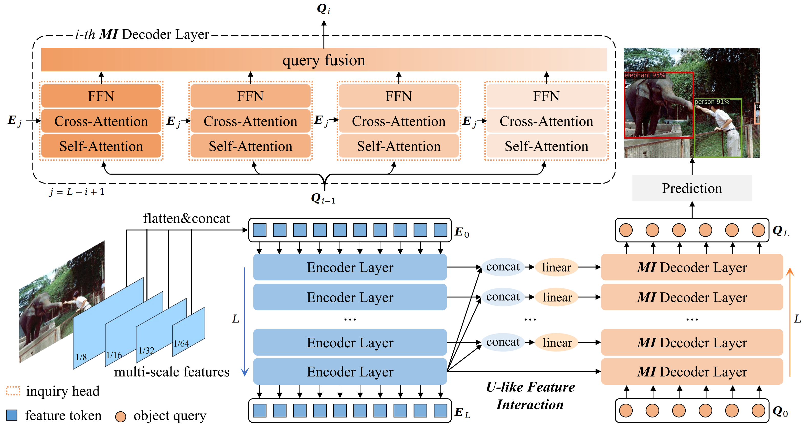

<h2 align="center"> <a href="https://arxiv.org/abs/2410.16707">MI-DETR: An Object Detection Model with Multi-time Inquiries Mechanism</a></h2>
<h4 align="center" color="A0A0A0"> Zhixiong Nan, Xianghong Li, Jifeng Dai, Tao Xiang</h4>
<h5 align="center"> If you like our project, please give us a star ⭐ on GitHub for the latest update.</h5>

<div align="center">

[](https://www.arxiv.org/abs/2503.01463)
[](https://github.com/CQU-ADHRI-Lab/MI-DETR)
[](https://github.com/CQU-ADHRI-Lab/MI-DETR/blob/main/LICENSE)

</div>

<div align=center>

</div>


# MI-DETR
This is the official implementation of the paper "MI-DETR: An Object Detection Model with Multi-time Inquiries Mechanism".

<div align="center">
  
</div><br/>

Based on analyzing the character of cascaded decoder architecture commonly adopted in existing DETR-like models, this paper proposes a new decoder architecture. _The cascaded decoder architecture constrains object queries to update in the cascaded direction, only enabling object queries to learn relatively-limited information from image features._ However, the challenges for object detection in natural scenes (e.g., extremely-small, heavily-occluded, and confusingly mixed with the background) require an object detection model to fully utilize image features, which motivates us to propose a new decoder architecture with the parallel **Multi-time Inquiries (MI)** mechanism. _**MI** enables object queries to learn more comprehensive information, and our **MI** based model, **MI-DETR**, outperforms all existing DETR-like models on COCO benchmark under different backbones and training epochs_,  achieving **+2.3** AP and **+0.6** AP improvements compared to the most representative model DINO and SOTA model Relation-DETR under ResNet-50 backbone.

## Update
[2025/2] MI-DETR has been accepted at CVPR 2024 as a poster!

## Installation

We tested our code with `Python=3.8.39, PyTorch=1.12.0, CUDA=11.3`. Please install PyTorch first according to [official instructions](https://pytorch.org/get-started/previous-versions/). Our code is based on [detrex](https://github.com/IDEA-Research/detrex/tree/main). Please refer to the [installation](https://detrex.readthedocs.io/en/latest/tutorials/Installation.html) of detrex.

Example conda environment setup：

```bash
# Create a new virtual environment
conda create -n midetr python=3.8 -y
conda activate midetr

# Install PyTorch
pip install torch==1.12.0+cu113 torchvision==0.13.0+cu113 torchaudio==0.12.0 --extra-index-url https://download.pytorch.org/whl/cu113

# initialize the detectron2 submodule
git init
git submodule init
git submodule update

# Install detectron2
python -m pip install 'git+https://github.com/facebookresearch/detectron2.git'

# Under your working directory
git clone https://github.com/IDEA-Research/detrex.git
cd detrex/
pip install -r requirements.txt

# build an editable version of detrex
pip install -e .
```

## Models

<table style="width: 100%; border-collapse: collapse;"  id="model-table">
    <tr style="border: 1px solid black; background-color: #f2f2f2; text-align: center; padding: 8px;">
        <th align="center">Name</th>
        <th align="center">Backbone</th>
        <th align="center">Epochs</th>
        <th align="center"><i>AP<sup style="font-size: smaller;">box</sup></i></th>
        <th align="center"><i>AP<sup style="font-size: smaller;">mask</sup></i></th>
        <th align="center">Download</th>
    </tr>
    <tr align="center">
        <td align="center"><a href="./configs/dimaskdino_r50_4scale_bs16_12ep.yaml" style="text-decoration: none; color: black;">DI-MaskDINO</a></td>
        <td align="center">ResNet50</td>
        <td align="center">12</td>
        <td align="center">46.9</td>
        <td align="center">42.3</td>
        <td align="center"><a href="https://drive.google.com/file/d/1oQociMQSt_jmQtH3pm92i6zat8Gt83Oh/view?usp=drive_link" style="text-decoration: none; color: blue;">model</a></td>
    </tr>
    <tr align="center">
        <td align="center"><a href="./configs/dimaskdino_r50_4scale_bs16_24ep.yaml" style="text-decoration: none; color: black;">DI-MaskDINO</a></td>
        <td align="center">ResNet50</td>
        <td align="center">24</td>
        <td align="center">49.6</td>
        <td align="center">44.8</td>
        <td align="center"><a href="https://drive.google.com/file/d/1FjoYiwGnrk_bk0nUM7GPeIMGENVLdx7n/view?usp=drive_link" style="text-decoration: none; color: blue;">model</a></td>
    </tr>
    <tr align="center">
        <td align="center"><a href="./configs/dimaskdino_r50_4scale_bs16_50ep.yaml" style="text-decoration: none; color: black;">DI-MaskDINO</a></td>
        <td align="center">ResNet50</td>
        <td align="center">50</td>
        <td align="center">51.9</td>
        <td align="center">46.7</td>
        <td align="center"><a href="https://drive.google.com/file/d/17_SErWYBWWCdYfR6i7OJtcBIlCDES10z/view?usp=drive_link" style="text-decoration: none; color: blue;">model</a></td>
    </tr>
</table>

## Run

### Training

Train DI-MaskDINO with 8 GPUs:

```sh
python train_net.py --num-gpus 8 --config-file configs/dimaskdino_r50_4scale_bs16_12ep.yaml OUTPUT_DIR /path/to/output
```

### Evaluation

You can download our pretrained models and evaluate them with the following commands. 
```sh
python train_net.py --eval-only --num-gpus 8 --config-file /path/to/config_file MODEL.WEIGHTS /path/to/checkpoint_file
```
For example, to reproduce our result, you can copy the config path from the model table, download the pretrained checkpoint into `/path/to/checkpoint_file`, and run 
```sh
python train_net.py --eval-only --num-gpus 8 --config-file configs/dimaskdino_r50_4scale_bs16_12ep.yaml MODEL.WEIGHTS /path/to/checkpoint_file
```


## <a name="CitingDIMaskDINO"></a>Citing DI-MaskDINO

If you find our work helpful for your research, please consider citing the following BibTeX entry.

```BibTeX
@inproceedings{nan2024di,
  title={DI-MaskDINO: A Joint Object Detection and Instance Segmentation Model}, 
  author={Zhixiong Nan and Xianghong Li and Tao Xiang and Jifeng Dai},
  booktitle={Proceedings of the Neural Information Processing Systems},
  year={2024}
}
```

## Acknowledgement

Many thanks to these excellent opensource projects: 
* [MaskDINO](https://github.com/IDEA-Research/MaskDINO)
* [Mask2Former](https://github.com/facebookresearch/Mask2Former) 
* [DINO](https://github.com/IDEA-Research/DINO)
