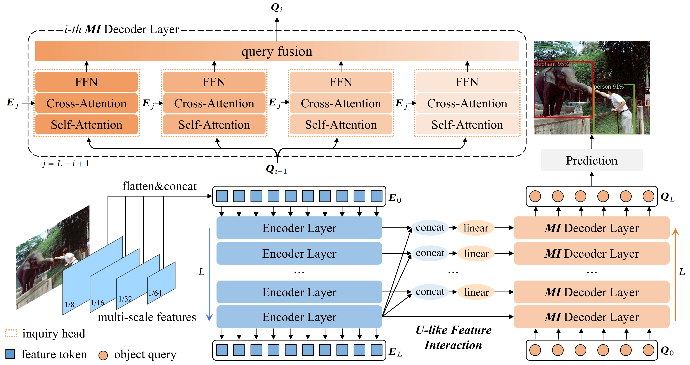

<h2 align="center"> <a href="https://arxiv.org/abs/2410.16707">MI-DETR: An Object Detection Model with Multi-time Inquiries Mechanism</a></h2>
<h4 align="center" color="A0A0A0"> Zhixiong Nan, Xianghong Li, Tao Xiang*, Jifeng Dai</h4>
<h5 align="center"> If you like our project, please give us a star ⭐ on GitHub for the latest update.</h5>

# MI-DETR
This is the official implementation of the paper "MI-DETR: An Object Detection Model with Multi-time Inquiries Mechanism".

  

 

## Update
[2025/2] MI-DETR has been accepted at CVPR 2024 as a poster!

